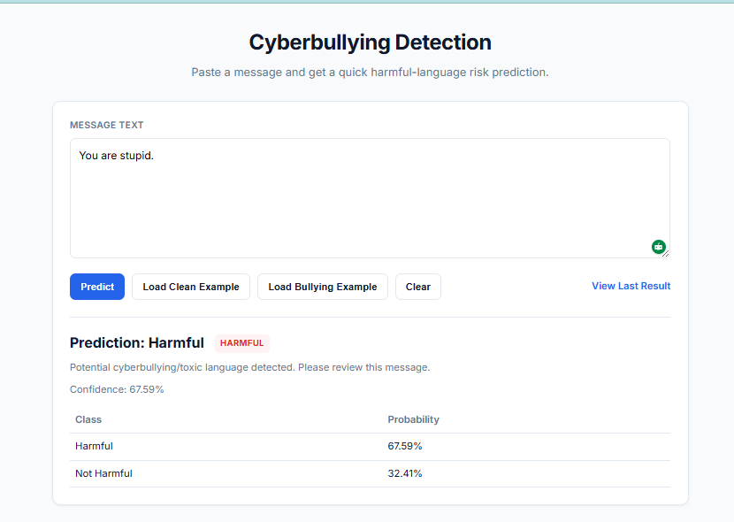
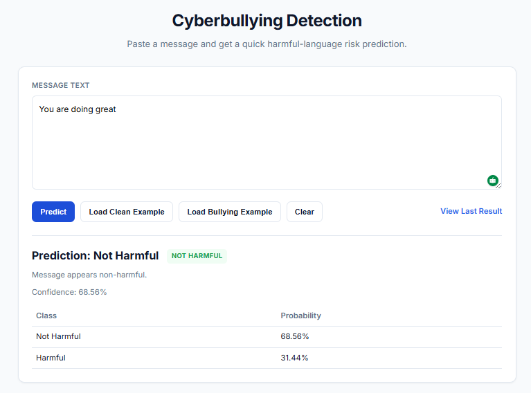
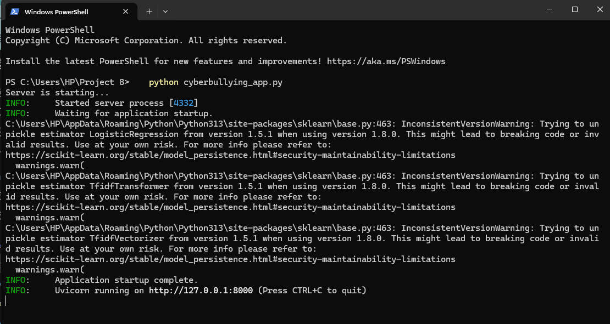
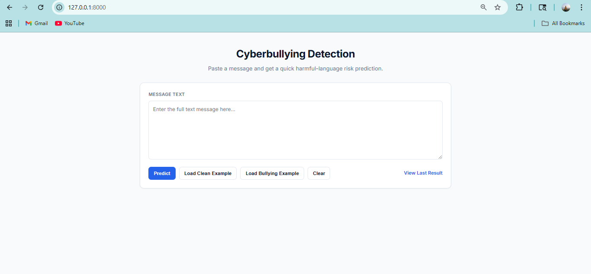
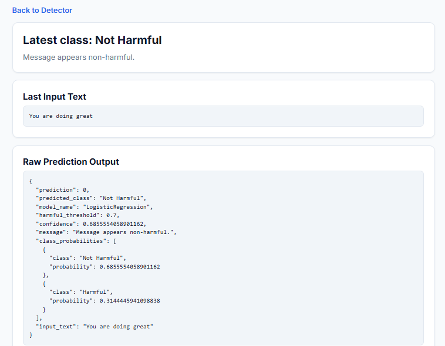

# Cyberbullying Detection using Machine Learning

## Project Overview

This project is a Machine Learning based Cyberbullying Detection System that identifies whether a text message contains harmful or bullying content. The system helps improve online safety by automatically detecting toxic messages.

---

## Features

* Detects cyberbullying text
* User-friendly frontend interface
* FastAPI backend integration
* Machine Learning based prediction
* Real-time prediction results
* Confidence score and probability display

---

## Technologies Used

* Python
* FastAPI
* Scikit-learn
* HTML/CSS
* Joblib
* TF-IDF Vectorizer

---

## Project Structure

```text
backend/                  -> FastAPI backend files
frontend/                 -> HTML frontend pages
model/                    -> Machine learning model files
requirements.txt          -> Required Python libraries
cyberbullying_app.py      -> Main application file
```

---

## Working Process

1. User enters text in frontend
2. Frontend sends request to backend API
3. Backend preprocesses text
4. TF-IDF Vectorizer converts text into numerical format
5. Machine learning model predicts result
6. Prediction is displayed to the user

---

## How to Run the Project

### Install Requirements

```bash
pip install -r requirements.txt
```

### Run Backend

```bash
python cyberbullying_app.py
```

### Open Frontend

Open in browser:

```text
http://127.0.0.1:8000
```

---

## Example Input

```text
You are stupid
```

### Example Output

```text
Cyberbullying Detected
```

---

## Project Screenshots

### Main Frontend Interface


---

### Backend Server Running


---

### Non-Harmful Prediction Output


---

### Harmful Prediction Output


---

### Raw Prediction Output


---

## Team Members

* Ayusman Mohanty
* Gourav Bal
* Asutosh Mishra
* Ayushman Sahoo

---

## Future Scope

* Multi-language support
* Voice-based detection
* Social media integration
* Real-time monitoring

---

## Conclusion

This project demonstrates how Machine Learning and FastAPI can be integrated to automatically detect harmful online messages and create a safer digital environment.
